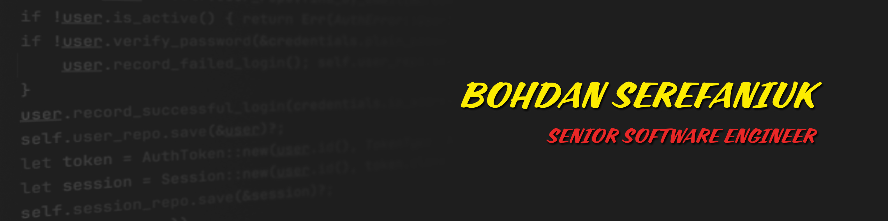

# Welcome to My GitHub Profile!

## About Me

Hello! 👋 I’m **Bohdan Serefaniuk** — a software engineer focused on **backend development, system architecture, and integrating AI into real-world products**.

Over the past seven years, I’ve built and scaled applications across healthcare, fintech, search, and digital marketplaces — always with a focus on **performance, scalability, and maintainability**.

My core stack includes **Node.js, Python, and modern cloud ecosystems** (AWS, Azure, GCP). I love designing robust APIs, event-driven systems, and distributed architectures, while seamlessly embedding AI features like chatbots and knowledge-driven assistants. Although I can step into the frontend when needed, my passion is the **backend and infrastructure layer**, where clean architecture and technical excellence matter most.

I’ve also **mentored teams, shaped technical strategies, and guided discovery phases**, but thrive as a hands-on engineer solving complex problems and shipping reliable code.

Currently based in **Barcelona, Spain**, I collaborate globally and work comfortably in distributed teams.

- 🌱 Always exploring better ways to design scalable backends and AI-powered features  
- 👯 Open to collaborating on challenging backend or AI integration projects  
- 💬 Ask me about Node.js, Python, cloud architecture, and event-driven systems  
- 📫 Reach me at [contact@bserefaniuk.es](mailto:contact@bserefaniuk.es)  
- ⚡ Fun fact: obsessed with optimizing performance for high-traffic apps

## My Skills

- **Languages:** TypeScript, JavaScript, Python, Rust, .NET C#  
- **Frameworks & Libraries:** Node.js, Nest.js, Express, FastAPI, React, Angular  
- **Databases:** PostgreSQL, MySQL, MongoDB, DynamoDB, Redis, Elasticsearch  
- **Cloud & Tools:** AWS, Azure, GCP, RabbitMQ, gRPC, GraphQL, Pulumi, Serverless Framework  

## Connect with Me

